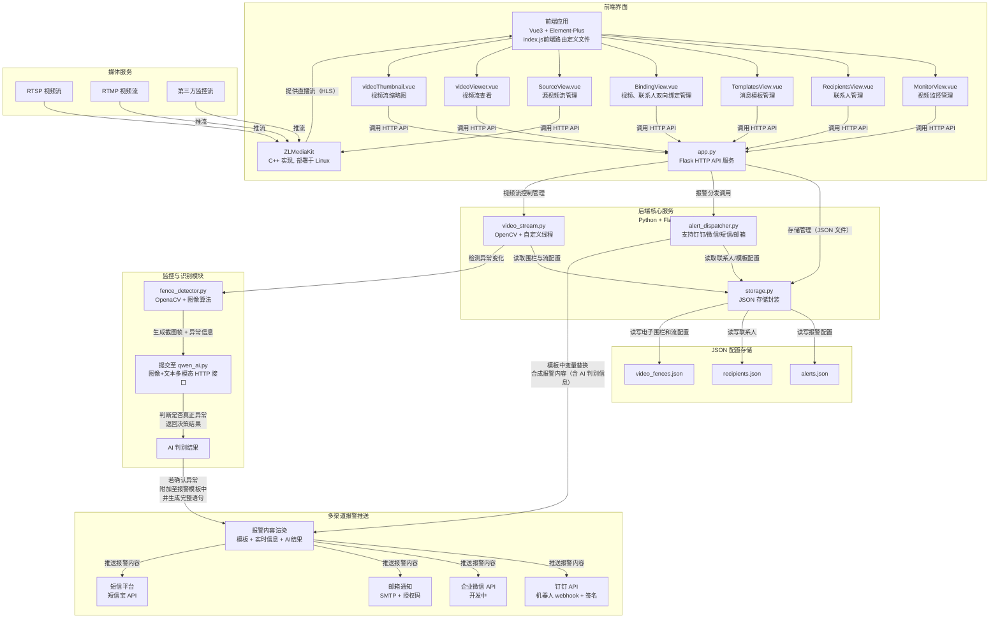

123123

# Ubuntu 部署说明文档

## 一、概述

本说明文档旨在指导开发与运维人员在 Ubuntu 系统环境下部署整个监控预警系统。系统架构包含前端 Vue3 应用、后端 Flask 服务、多线程视频流处理模块、ZLMediaKit 媒体流服务器以及报警推送服务。文档涵盖各组件安装、配置及启动流程，确保系统稳定运行。

---

## 二、环境准备

### 1. 操作系统

- Ubuntu 20.04 LTS 或以上版本（推荐最新稳定版）

### 2. 基础依赖安装

```bash
sudo apt update && sudo apt upgrade -y
sudo apt install -y python3 python3-pip python3-venv ffmpeg git curl build-essential
````

### 3. 安装并配置 ZLMediaKit

ZLMediaKit 负责媒体流的接收和转发（RTSP/RTMP 转 HLS 等）。

* 获取源码或下载预编译版本：

```bash
git clone --depth 1 https://gitee.com/xia-chu/ZLMediaKit
cd ZLMediaKit
git submodule update --init
```

* 编译：

```bash
sudo apt-get install build-essential
sudo apt-get install cmake
mkdir build && cd build
cmake ..
make -j4
```

* 配置 ZLMediaKit（修改配置文件，确保监听端口和推流路径正确）：
  配置文件通常位于 `/etc/ZLMediaKit/config.ini`，主要关注：

    * 身份验证SECRET

* 启动 ZLMediaKit：

```bash
cd ZLMediaKit/release/linux/Debug
./MediaServer
```

或使用 systemd 服务脚本管理启动。

---

## 三、后端服务部署（Flask + 多线程）

### 1. 创建 Python 虚拟环境

```bash
python3 -m venv venv
source venv/bin/activate
```

### 2. 安装依赖库

```bash
pip install -r requirements.txt
```

`requirements.txt` 应包含：

* Flask
* OpenCV-python
* requests
* 其他业务相关依赖

### 3. 启动后端服务

```bash
python app.py
```

---

## 四、前端部署

### 1. 安装 Node.js 和 npm

```bash
curl -fsSL https://deb.nodesource.com/setup_18.x | sudo -E bash -
sudo apt install -y nodejs
```

### 2. 构建前端项目

```bash
cd frontend
npm install
npm run build
```

### 3. 部署静态文件

* 可将构建后的静态文件放置在 Nginx 服务器的根目录，或由 Flask 提供静态文件服务。
* 配置 Nginx 反向代理，指向 Flask 后端 API 和前端静态文件。

---

## 五、媒体流推送与测试

### 1. 媒体流管理

ZLMediaKit 视频流的新增、删除和修改操作均已集成在前端的“源视频流管理”界面中，无需手动使用 ffmpeg 推流。通过前端界面即可完成所有流的管理和配置。

### 2. 测试播放

* 访问前端页面，前端通过 ZLMediaKit 提供的 HLS 或 FLV 流（如 `http://your_server_ip/live/test/hls.m3u8`）进行播放。
* 确认视频正常显示且无卡顿。

---

## 六、报警系统配置

### 1. 联系人与模板管理

* 编辑或通过前端界面管理 `recipients.json` 和 `alerts.json`，配置报警联系人及消息模板。

### 2. 第三方服务接入

* 配置钉钉机器人 webhook 和签名
* 配置企业微信（开发中）
* 配置 SMTP 邮箱服务及授权码
* 配置短信平台 API

---

## 七、日志与监控

* 后端 Flask 服务日志默认输出到控制台，建议配置日志文件。
* ZLMediaKit 日志位于安装目录，可查看流推送及转发状态。
* 可结合 `systemd` 日志或使用 `journalctl` 查看服务状态。

---

## 八、常见问题及解决方案

| 问题              | 解决方案                          |
|-----------------|-------------------------------|
| ZLMediaKit 无法启动 | 检查依赖库是否安装完整，端口是否被占用           |
| 后端接口连接超时或失败     | 确认 Flask 服务是否启动，网络防火墙设置       |
| 前端无法播放视频流       | 确认流地址正确，ZLMediaKit HLS 输出是否正常 |
| 报警推送失败          | 检查第三方服务配置及网络连通性               |

---

# 附录

* 系统架构逻辑图

* 相关链接：

    * [ZLMediaKit 官方文档](https://github.com/ZLMediaKit/ZLMediaKit/wiki/%E5%BF%AB%E9%80%9F%E5%BC%80%E5%A7%8B)
    * [Flask 官方文档](https://flask.palletsprojects.com/)
    * [Vue3 官方文档](https://v3.vuejs.org/)
